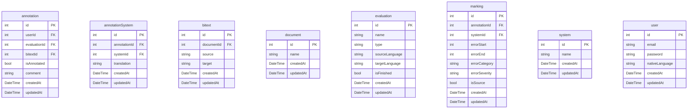

# Backend

## A. Database ER Diagram

```mermaid
erDiagram
    annotation {
        int id PK
        int userId FK
        int evaluationId FK
        int bitextId FK
        bool isAnnotated
        string comment
        DateTime createdAt
        DateTime updatedAt
    }

    annotationSystem {
        int id PK
        int annotationId FK
        int systemId FK
        string translation
        DateTime createdAt
        DateTime updatedAt
    }

    bitext {
        int id PK
        int documentId FK
        string source
        string target
        DateTime createdAt
        DateTime updatedAt
    }

    document {
        int id PK
        string name
        DateTime createdAt
        DateTime updatedAt
    }

    evaluation {
        int id PK
        string name
        string type
        string sourceLanguage
        string targetLanguage
        bool isFinished
        DateTime createdAt
        DateTime updatedAt
    }

    marking {
        int id PK
        int annotationId FK
        int systemId FK
        int errorStart
        int errorEnd
        string errorCategory
        string errorSeverity
        bool isSource
        DateTime createdAt
        DateTime updatedAt
    }

    system {
        int id PK
        string name
        DateTime createdAt
        DateTime updatedAt
    }

    user {
        int id PK
        string email
        string password
        string nativeLanguage
        DateTime createdAt
        DateTime updatedAt
    }
```
