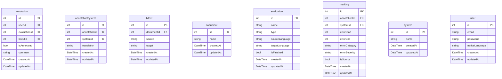

# Backend

The backend server for the Human Evaluation Tool, built with Flask and SQLAlchemy.

## Architecture

The backend follows a modular architecture with the following structure:

```
backend/
├── src/
│   └── human_evaluation_tool/
│       ├── models/          # Database models
│       │   ├── annotation.py
│       │   ├── bitext.py
│       │   ├── document.py
│       │   ├── evaluation.py
│       │   ├── marking.py
│       │   ├── system.py
│       │   └── user.py
│       ├── resources/       # API endpoints
│       │   ├── annotation.py
│       │   ├── bitext.py
│       │   ├── document.py
│       │   ├── evaluation.py
│       │   ├── marking.py
│       │   ├── system.py
│       │   └── user.py
│       ├── auth.py         # Authentication logic
│       └── utils.py        # Utility functions
├── main.py                 # Application entry point
├── flask.config.json       # Flask configuration
└── pyproject.toml         # Project dependencies
```

## Key Components

### Models

The application uses SQLAlchemy ORM with the following models:

- **User**: Manages user accounts and authentication
- **Document**: Represents source documents for translation
- **System**: Represents MT systems being evaluated
- **Evaluation**: Manages evaluation projects
- **Bitext**: Stores source-target text pairs
- **Annotation**: Stores user annotations
- **Marking**: Manages error markings and categories
- **AnnotationSystem**: Links annotations with system outputs

### Resources (API Endpoints)

The API follows RESTful principles with these main endpoints:

- `/api/users`: User management
- `/api/documents`: Document management
- `/api/systems`: MT system management
- `/api/evaluations`: Evaluation project management
- `/api/bitexts`: Source-target text management
- `/api/annotations`: Annotation management
- `/api/markings`: Error marking management

### Authentication

- JWT-based authentication using `flask-jwt-extended`
- Token refresh mechanism
- Role-based access control

## Database Schema


