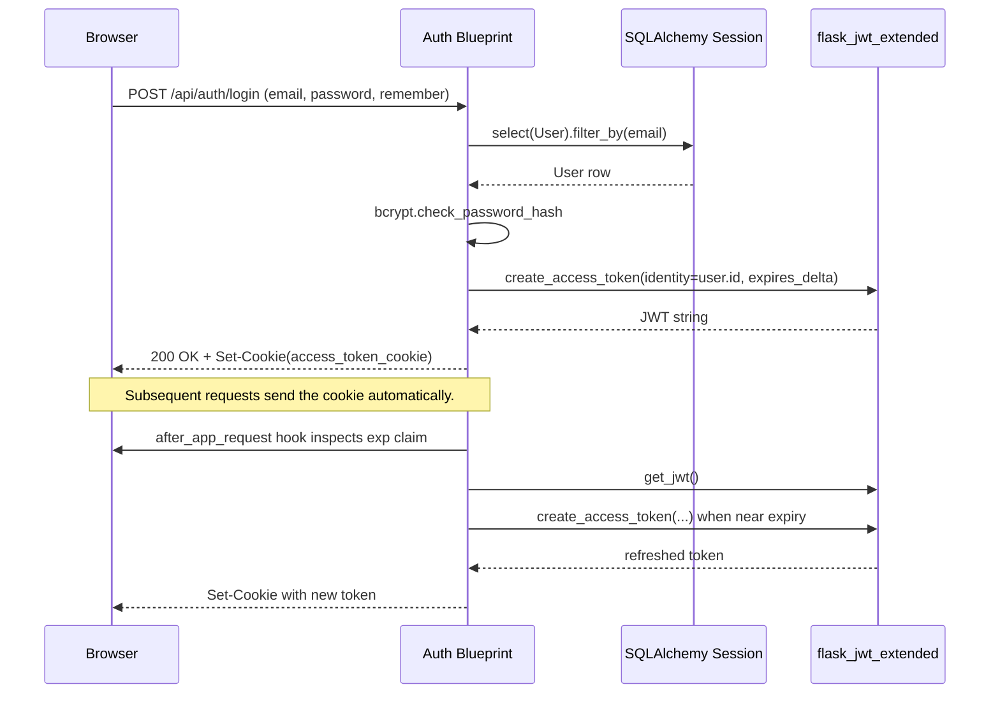
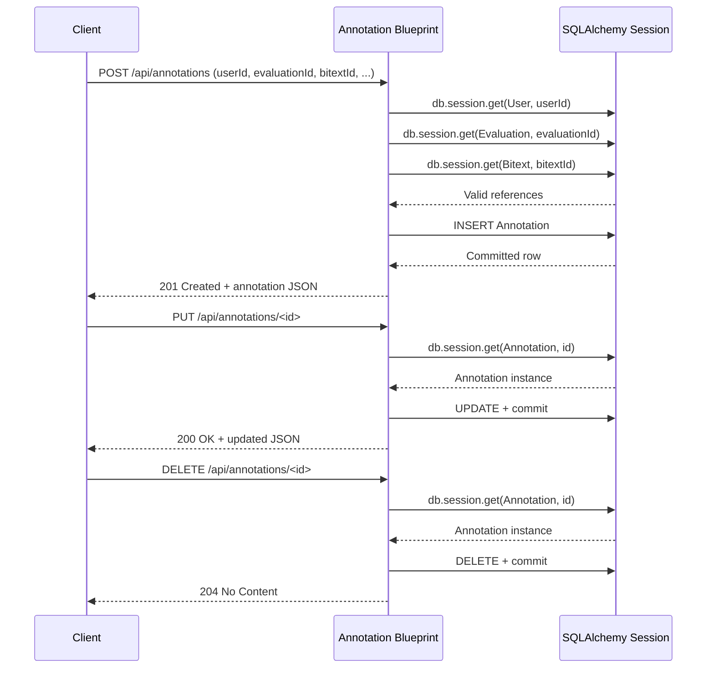
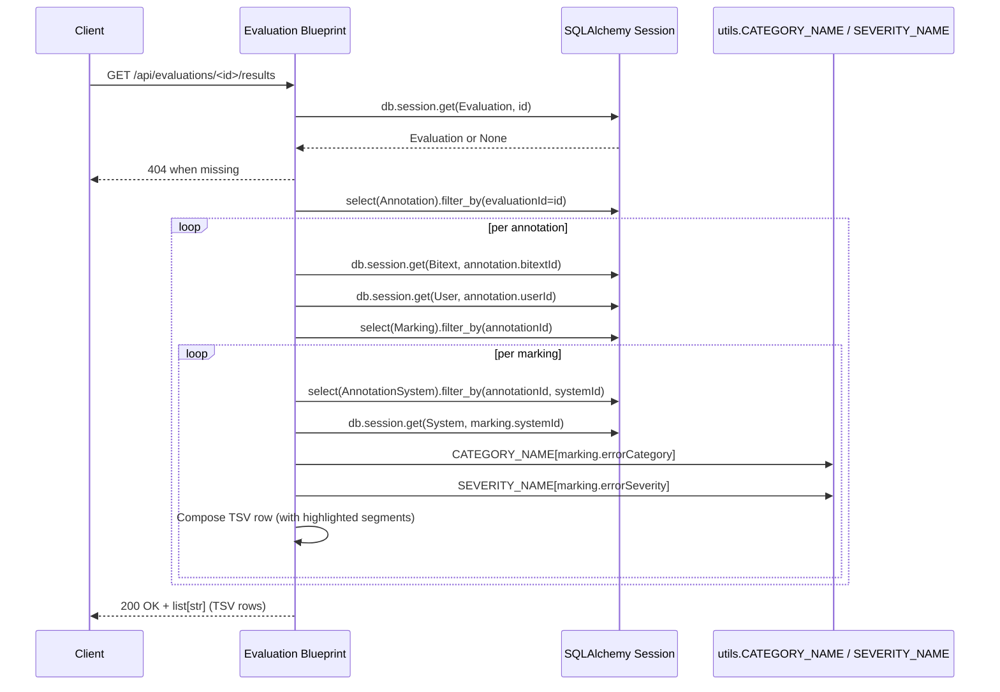

# API Flows

The backend exposes a REST API composed of the authentication blueprint and seven resource blueprints. This document highlights the most important interactions with Mermaid sequence diagrams and lists the available endpoints.

## Authentication – login and refresh

`GET /api/auth/validate` requires a valid JWT and returns `{"success": False}` to match the existing front-end contract. `POST /api/auth/logout` clears the cookie and returns `{"success": True}`.

## Annotation lifecycle

All annotation routes require JWT authentication. `GET /api/annotations` scopes results to the current user by inspecting `get_jwt_identity()`.

## Evaluation results export

When the marking references a segment in the source, the code wraps the relevant tokens with `<v>`/`</v>` markers; otherwise the translation text receives the markers. Newlines are normalised to ` ` in both source and translation strings.

## Endpoint summary

| Blueprint | Base path | Description |
|-----------|-----------|-------------|
| `auth` | `/api/auth` | Login, logout, validate; refresh hook registered globally |
| `users` | `/api/users` | CRUD for user accounts; unique email enforcement |
| `systems` | `/api/systems` | CRUD for machine translation systems |
| `documents` | `/api/documents` | CRUD for source documents |
| `bitexts` | `/api/bitexts` | CRUD for aligned source/target segments |
| `evaluations` | `/api/evaluations` | CRUD, annotation listing, TSV export |
| `annotations` | `/api/annotations` | CRUD scoped to authenticated user |
| `markings` | `/api/annotations/<annotation_id>/markings` and `/api/annotations/<annotation_id>/systems/<system_id>/markings` | Marking collection and per-system CRUD with ownership checks |

All resource blueprints enforce JWT authentication via `@jwt_required()`; the tests use fixtures to issue valid cookies for authenticated scenarios.
