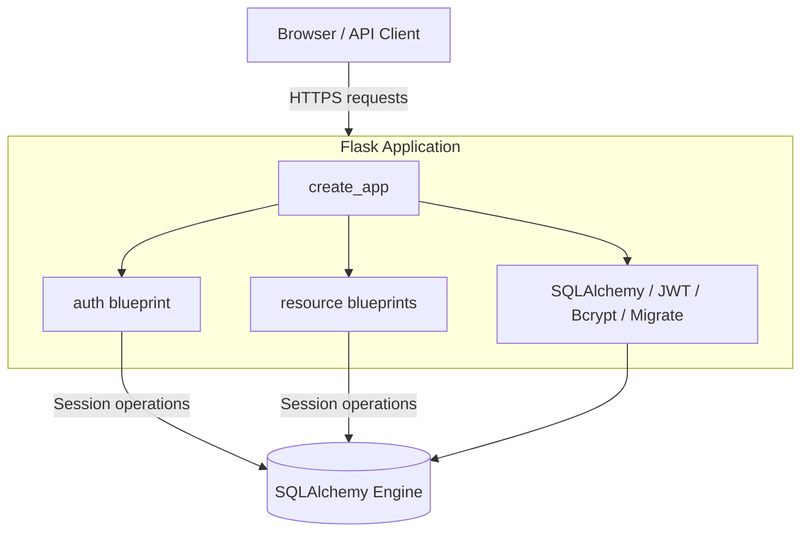
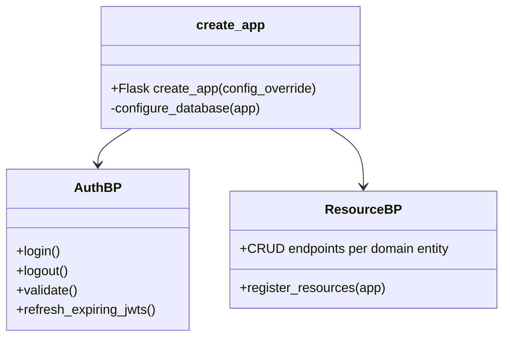

# Backend Architecture

This document reverse-engineers the Python backend that powers the Human Evaluation Tool. It summarises how the Flask application is assembled, how configuration flows through the system, and how modules collaborate at runtime.

## Runtime overview

1. `create_app` instantiates `Flask`, loads configuration (`flask.config.json`, overrides, environment variables), initialises extensions, and registers blueprints.
2. Requests are routed to blueprints (`auth` or the resource modules) which contain typed view functions.
3. Each handler uses the shared `db.session` to interact with the SQLAlchemy 2.0 models defined under `human_evaluation_tool.models`.
4. Responses are JSON payloads (or TSV strings for evaluation exports) with consistent status codes.

## Configuration layers

The factory loads configuration in the following order:

1. `flask.config.json` – houses JWT cookie defaults.
2. Explicit overrides passed to `create_app` – used by tests and the development runner.
3. Environment variables – either `SQLALCHEMY_DATABASE_URI` or the five `DB_*` pieces that form a PostgreSQL URL, plus `JWT_SECRET_KEY`.

If neither a URI nor the `DB_*` variables are provided, the factory raises a descriptive `RuntimeError`. The CLI runner (`backend/main.py`) and the module-level default app fall back to SQLite and a deterministic JWT secret to simplify local workflows.

## Module structure

- `human_evaluation_tool/__init__.py` – defines the declarative `Base`, configures Flask extensions, implements `create_app`, and exports a ready-to-serve `app` object for WSGI servers.
- `human_evaluation_tool/auth.py` – authentication blueprint implementing login, logout, JWT validation, and the `after_app_request` refresh hook.
- `human_evaluation_tool/resources/` – REST blueprints for users, systems, documents, bitexts, evaluations, annotations, and markings. Each module scopes helper functions and enforces validation/authorisation.
- `human_evaluation_tool/models/` – SQLAlchemy 2.0 typed models with relationships that mirror the evaluation domain.
- `human_evaluation_tool/utils.py` – shared category/severity lookup tables used when exporting evaluation results.

## Static asset delivery

`create_app` points `static_folder` at `<repo-root>/public`. Requests to `/` or `/path` return files directly from this directory, allowing the backend to serve the compiled front-end bundle in production deployments.

## Database lifecycle

- Flask-SQLAlchemy is initialised with the typed declarative `Base` to keep the ORM consistent.
- Tests use an in-memory SQLite database with `StaticPool` and `check_same_thread=False`, created/dropped around every test via fixtures.
- In production the engine targets PostgreSQL using credentials from the environment.

## Error handling and responses

Every mutation endpoint wraps database operations in `try/except SQLAlchemyError` blocks to ensure rollbacks on failure. Validation errors respond with `422`, conflicts with `409`, missing resources with `404`, and unauthorised access with `401`.

## Related documents

- [Domain model](domain-model.md) – field-level details and ER/class diagrams.
- [API flows](api-flows.md) – request/response sequences for key scenarios.
- [Testing and quality](testing-and-quality.md) – pytest, coverage, and mypy workflows.
