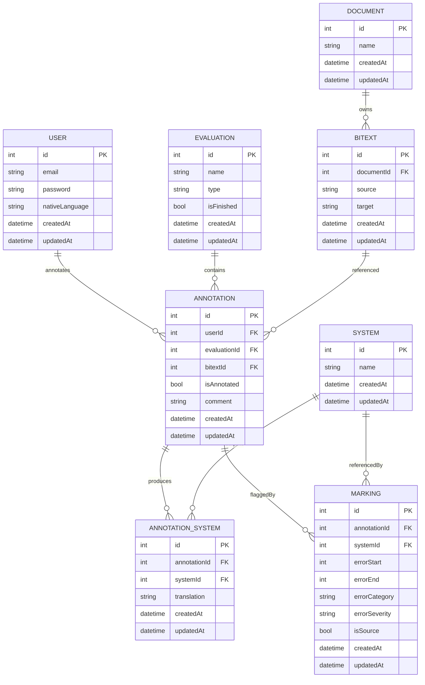
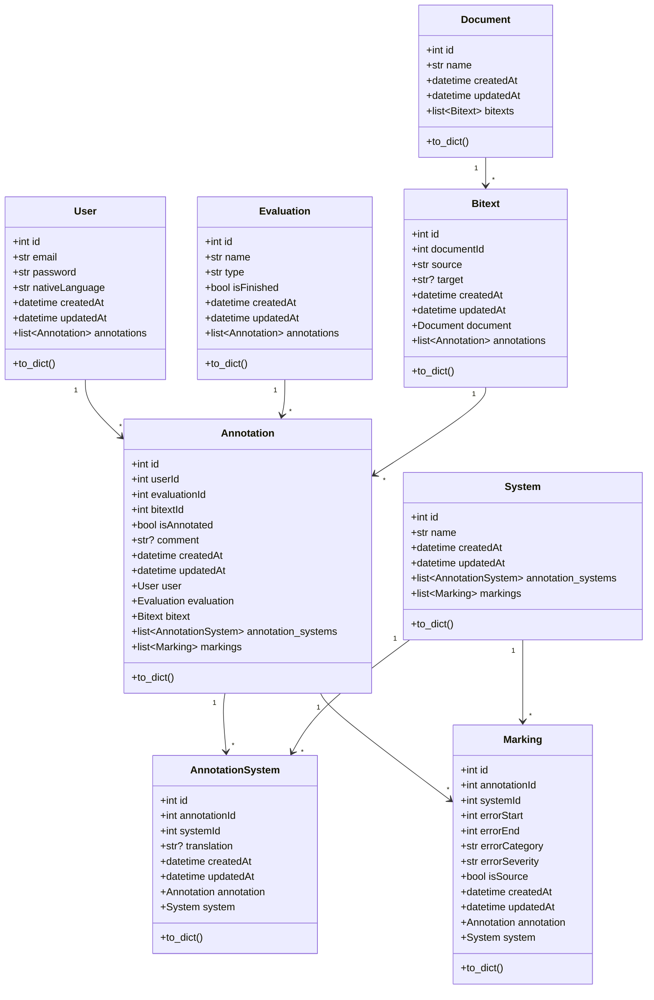

# Domain Model

The Human Evaluation Tool manages translation evaluation projects. The database schema is centred on annotations performed by users on bitext pairs, enriched with system outputs and marking metadata.

## Entity-relationship diagram

## Class relationships

## Invariants

- `Annotation` rows require valid foreign keys to `User`, `Evaluation`, and `Bitext` records. The API validates these relationships before creation or update.
- `AnnotationSystem` rows always pair one annotation with one system translation output. The combination `(annotationId, systemId)` is effectively unique from the application’s perspective.
- `Marking` rows reference both an `Annotation` and the `System` responsible for the translation; the API enforces user ownership before allowing marking operations.
- Timestamps (`createdAt`, `updatedAt`) are managed in application code for consistency across SQLite/PostgreSQL backends.

## Derived data

The evaluation results endpoint (`GET /api/evaluations/<id>/results`) joins annotations, bitexts, annotation systems, and markings to emit TSV rows. Category and severity names are resolved through the lookup dictionaries defined in `human_evaluation_tool.utils`.
